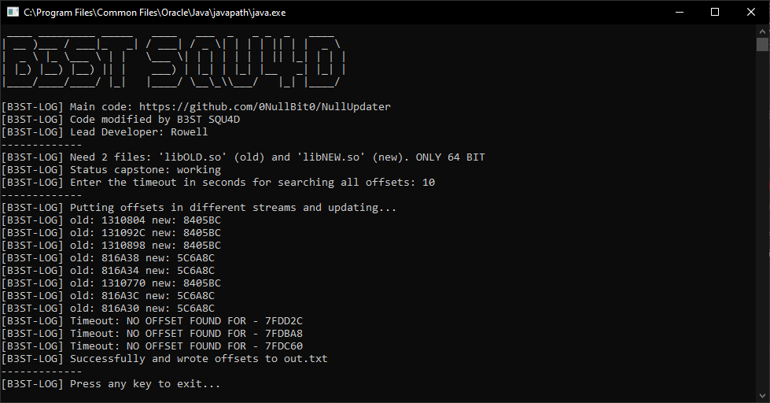

# AutoUpdateOffsets  

Automatically update arm64 offsets for compiled libraries like libil2cpp and others.  

### Requirements:  
- Java Development Kit version 20 or higher.  

### Original Code:  
This project is based on the source code from [NullUpdater](https://github.com/0NullBit0/NullUpdater).  

### Added Features:  
- **Timer for offset search** — for better control over execution time.  
- **Concurrent search for multiple offsets** — the speed depends on your process.  

### Usage:  
1. Download `AutoUpdateOffsets.jar` from the releases tab.  
2. Prepare the necessary binaries.  
3. Make sure you have **two libraries** ready:  
   - The **old** version named `libOLD.so`  
   - The **new** version named `libNEW.so`  
4. Create an `offsets.txt` file where the old offsets are listed in hexadecimal format, either with a `0x` prefix or without.  

**Example of `offsets.txt`:**  
```
# Lines starting with a hashtag will be ignored
0x12345  
0xDEAD  
0xFED  
0xACE  
0xFFFF  
or
12345  
DEAD  
FED  
ACE  
FFFF  
```

5. Run the following command:  
```
java -jar AutoUpdateOffsets.jar
```

# Preview:  
